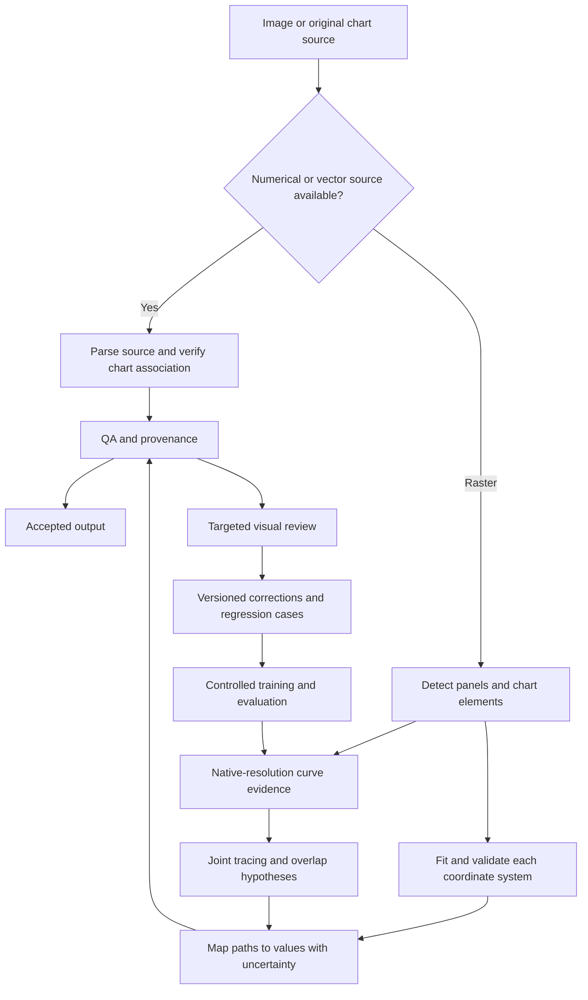

# Reliable extraction of data from graph images

## 1. Recommendation

Build a specialized, trainable graph digitizer with explicit geometry, curve identity, and uncertainty. Use machine learning to recognize panels, chart elements, and individual curves; use geometric calibration and global curve tracking to turn those predictions into measurements. Preserve the original image coordinates throughout. Make corrections in a visual editor feed a controlled training and regression process.

The collection of similar graphs is a substantial advantage: rendering styles, layouts, and curve distributions can be reproduced for training. However, more examples alone will not repair destructive preprocessing, incorrect calibration, an inadequate representation of overlaps, or an evaluator that rewards incomplete extraction. Those problems already exist in the current attempt and should be addressed first.

One-pixel accuracy is a meaningful target for sufficiently resolved, visible curve centerlines. Fully hidden data may be unidentifiable: two different underlying curves can produce exactly the same raster image. In that case the correct result is an explicit overlap/occlusion hypothesis, alternative identities, or an unresolved interval. Training can improve a prediction of the hidden data; it cannot turn that prediction into an observation.

This plan covers raster line graphs first, including multiple panels, logarithmic and linear axes, percentage and dB ordinates, and the time-domain graphs present in the sample collection. It also includes a path for extracting original numerical or vector data when available. It does not propose training a general chart-reading language model as the first implementation.

## 2. Research findings

The sources below were accessed on 10 September 2026. Published results are distinguished from recommendations for this repository. There is no verified public benchmark result in these sources that establishes reliable, fully automatic, one-pixel extraction across this collection's dense curves, axis types, annotations, and multi-panel layouts. Scores from different datasets and metrics should not be ranked as though they measure the same requirement.

| Approach and source | What the evidence supports | Implication for this project |
|---|---|---|
| WebPlotDigitizer documentation [1] | Explicit calibration, region selection, color-based extraction, manual correction, and pixel-coordinate mode are mature workflows. | Use it as an assisted baseline and interoperability target. Measure operator time as well as accuracy. |
| ChartOCR, WACV 2021 [2] | A hybrid neural/keypoint and rule-based pipeline handles chart components and produces semantic intermediate results; introduces ExcelChart400K. | Separate chart understanding from numerical measurement. Reuse the decomposition, but validate geometry and dense tracing independently. |
| LineFormer, ICDAR 2023 [3] | Treats every line as an independent instance mask, allowing multiple masks to occupy the same pixel. Reports better extraction on synthetic and real chart benchmarks than its compared baselines. | The most directly useful reproducible model baseline for overlapping curves. Benchmark it before designing a larger model. |
| DePlot, 2022/2023 [4] | Converts plots into tables for downstream language reasoning. | A chart-to-table baseline or semantic assistant; its task and metrics do not establish dense native-pixel measurement. |
| ChartZero, May 2026 preprint [5] | Trains on 100,000 synthetic charts using a U-Net with instance embeddings and a topology-oriented loss; uses a VLM for legend/axis semantics. Reports a 1,000-chart reconstruction benchmark. | Strong motivation for synthetic training and separating geometry from semantics. Treat it as an experimental direction pending reproduction. |
| ExChart, CHI 2026 paper / June arXiv posting [6] | Trains coordinate perception before chart-to-table alignment. Reports Adaptive MAPE improving from 16.01% to 4.87% for its 7B base model. Its authors still require interactive verification for reliable extraction. | Training helps numerical grounding. Even a substantial improvement in table accuracy does not satisfy this project's one-pixel contract. |
| PlotPick, May 2026 preprint [7] | Evaluates VLM extraction using a 5% relative numeric matching tolerance; its PlotQA comparison uses best-column matching. | Strong reported recall cannot be interpreted as complete, correctly identified, pixel-accurate recovery of every curve. |
| Self-Ensembling VLMs, May 2026 preprint [8] | Repeated extraction and aggregation improve many table scores; disagreement provides a useful diagnostic. The paper explicitly says agreement is not calibrated correctness and systematic errors can persist. | Use independent-model disagreement to prioritize review. Do not use model consensus as ground truth or as the sole acceptance criterion. |

### What matters in the model details

LineFormer predicts independent masks using a Mask2Former-style architecture with a Swin-T backbone. Its paper explicitly discusses crossings, occlusion, and crowding. It permits shared pixels between line instances, which is essential here. However, its training masks have a fixed three-pixel thickness, its extraction stage interpolates gaps, and numerical conversion can use ground-truth axis information. It also documents duplicate predicted curves [3]. These are reasons to adapt and test the method, rather than treating its output as a finished digitizer.

ChartZero provides newer evidence for a relatively small segmentation architecture trained on diverse synthetic data. It reports instance swaps at acute intersections and merged or phantom curves in dense groups, occurring in approximately 4.2% and 3.9% of charts in its evaluation. Its axis stage locates a primary quadrangle and asks a VLM for ranges and scales; its reconstruction metric combines semantic correctness with a normalized RMSE score [5]. That does not demonstrate one-pixel multi-panel calibration. A public implementation/checkpoint for ChartZero was not verified in this review; reproducing its reported performance is a separate experiment.

ExChart's 3,600-chart benchmark contains 744 real and 2,856 synthetic charts. It evaluates 33,757 numerical values, including 9,494 values across 700 line charts, and supplies output templates at evaluation [6]. This is useful evidence about coordinate understanding, but roughly fourteen values per line-chart image is a different target from tracing several series at every source-image column.

The practical state of the art is therefore a collection of useful components: learned chart structure, instance segmentation, synthetic supervision, explicit calibration, and interactive verification. The recommended system combines those components and evaluates them against the actual task. A large multimodal model may help read unfamiliar legends and units, but its generated coordinates should not become the measurement authority without pixel-level validation.

## 3. Why this problem is difficult

**Chart structure and curve geometry are coupled.** A frame, a grid line, a flat data curve, an annotation leader, and a tick mark can all be thin straight strokes. A plot-area detector may correctly find a rectangle while cutting off the labels needed to interpret it. Small calibration errors affect every point, even when the curve mask looks excellent.

**Rasterization loses information.** Anti-aliasing blends foreground and background colors. Thin strokes can have no fully saturated interior pixel. Compression and rescaling alter color and position. Thick or blended strokes do not always identify a unique centerline to one pixel. Upscaling can assist recognition, but it does not restore lost evidence or create additional measurement resolution.

**Curve identity is a global problem.** At a crossing, a local nearest-neighbor decision may connect the left half of one curve to the right half of another. Color can change at blended crossings or be shared by two series. Repeated dashed segments create genuine rendering gaps. Long coincident sections may hide one line entirely. Decisions require evidence on both sides and sometimes remain ambiguous.

**The original data samples are not necessarily recoverable.** A raster shows a rendered path, potentially after interpolation, smoothing, clipping, or decimation. A successful digitizer reconstructs that displayed path and its coordinate mapping. Recovering the exact original sample locations or unsmoothed measurement values requires the original source data.

**Several panels create several coordinate systems.** Panels can have different units, ranges, scales, legends, and curve identities. Insets and shared axes create relationships beyond a simple left/right split. A failure in one panel must not overwrite or silently mislabel the data in another.

**A plausible overlay is insufficient evidence.** An incorrect path can fit the same raster at an occlusion. A missing middle section can look correct when an exporter connects its endpoints. A high mean score can hide one severe identity swap. QA must explicitly measure completeness, correspondence, and uncertainty.

## 4. Findings from the current attempt

The review covered `src/graphextract`, `src/spinorama/extract`, the extraction/report command-line scripts, the two extraction test files, and the ten local PNG samples. The source revision was `b38d2715441f134a63b737b2fd913d14058a2643`. The code index was about ten days old; findings were checked against the working-tree files.

The samples contain eight 2000×600 images and two 1000×600 images. They include side-by-side distortion panels, percentage axes, different driver curves, and a step response with a linear time axis and negative ordinate values. Three representative images were visually inspected at their original dimensions; all ten were passed through panel detection and attempted calibration. These checks do not constitute an annotated accuracy benchmark.

### Structural problems

| Area | Current behavior and location | Consequence and required change |
|---|---|---|
| Panel detection | `plot_detect.py:41` uses near-white thresholding, external contours, a 10% image-area minimum, and restricted aspect ratios. Its fallback at line 72 only proposes a side-by-side split. | Small/inset/stacked panels are not modeled reliably. Separate panel envelopes from plot interiors, and detect arbitrary panel arrangements. |
| Cropping and labels | Detected contour boxes can surround the plot itself; the orchestrator then calibrates that crop (`distortion.py:44`). | Axis labels and legends may already be outside the crop. Keep a context envelope and a separate interior geometry. |
| Coordinate system | `AxisCalibration` in `axis_calibrate.py:39` assumes log frequency and linear dB. OCR reads fixed bottom/left strips at line 111. | Percentage graphs and time-domain graphs need explicit units and scale types, not this specialized mapping. |
| Calibration fallback | `axis_calibrate.py:437` assigns detected grid lines to standard frequencies and a 100 dB top with 10 dB steps. Line 249 hardcodes a 20 Hz–20 kHz, 20–100 dB layout. | Geometrically plausible but numerically wrong output is possible. Unreadable scales must produce a review requirement, not guessed measurements. |
| Color identity | Fixed HSV specifications in `color_segment.py:40` and `extract_spinorama_colors.py`; legend sampling exists but is not used by `segment_curves`. | A color is treated as a predefined semantic curve. Actual sample palettes and legends differ. Infer style and identity per panel. |
| Destructive segmentation | `color_segment.py:72` builds a thick, dilated grid mask; line 109 masks the bottom 5%; line 153 applies opening/closing with a kernel of at least 2×2. | Valid thin lines and low-valued data can disappear; morphological operations can shift or merge evidence. Preserve the raster and predict separate evidence layers. |
| Tracking | `curve_trace.py:81` selects clusters using recent positions; line 128 traces each mask independently, skips missing columns, and applies smoothing. | No joint identity reasoning or explicit overlap/gap state. A short local tracker cannot reliably recover identities through dense crossings. |
| Subpixel claim | The weighted centroid usually receives a binary mask. | Floating-point output alone is not subpixel evidence. Fit the original intensity/color profile locally and measure its uncertainty. |
| Evaluation | `eval_extraction.py:326` and the CLI default to oracle calibration. Auto mode constructs one full-image region instead of exercising panel detection. | Default evaluation bypasses the difficult geometry; even auto mode is not a complete multi-panel production test. |
| Scoring | `compare_curves` at line 210 interpolates across gaps and measures endpoint-span coverage. Graph success at line 447 requires any matched curve. | Missing curves/interiors may not invalidate success. Score every expected series and every supported interval, plus unmatched predictions. |
| Test discovery | `tests/test_eval_extraction.old` and `tests/test_extract_distortion.old` are not standard pytest `.py` test files; no custom collection rule was found. | Existing checks are outside normal pytest discovery. Some tolerances are also much weaker than one pixel, including an oracle smoke check allowing RMS below 10 dB. |
| Panel naming | `scripts/report_extraction.py:92` keys aggregated curves by title and curve name. Empty or repeated titles can collide. | Use stable image/panel/series IDs independently of human-readable names. |

### Reproduced failures

The accompanying [audit script](research/audit_current_attempt.py) records small deterministic probes and sample calibration attempts. Its [results](research/audit_results_2026-09-10.json) were produced with Python 3.12.14, OpenCV 5.0.0, NumPy 2.5.2, and SciPy 1.18.1. `pytesseract` was absent in that environment.

1. **All 18 detected sample regions failed calibration.** `_detect_grid_lines` assumes Hough lines have an `(N,1,4)` shape and unpacks `line[0]`. In this environment the returned shape differs, producing `TypeError: cannot unpack non-iterable numpy.int32 object`. The color-segmentation grid helper already accommodates both layouts; the calibration helper does not. This is an environment-specific reproducible failure, not a measured accuracy rate for all deployments.
2. **A one-pixel horizontal red line with 180 source pixels produced zero segmented pixels.** The morphology destroys exactly the sort of evidence the task requires.
3. **A five-pixel one-column excursion was shifted by 2.5714 pixels after tracing/smoothing**, despite supplying an exact mask and calibration. Whether such an excursion is signal or noise must be decided from evidence, not an unconditional smoothing step.
4. **Two endpoints of an otherwise unobserved flat curve received RMS 0, correlation 1, and frequency coverage 1.** Interpolation fills the missing interior during scoring. The reconstructed flat values happen to agree with this synthetic truth, but the metric cannot distinguish measured coverage from unsupported interpolation.

The useful assets are the modular pipeline boundaries, Plotly source-data decoder, rendering/evaluation scaffold, WPD export, and existing reports. Keep them as baselines and adapters. Replace their measurement contracts and evaluation logic before optimizing extraction scores.

## 5. Define the one-pixel contract

### Coordinates and output

Use original image pixel coordinates, with the center of the top-left pixel at `(0,0)`. Store dimensions, hash, crop offsets, and all transformations. Use continuous coordinates internally. Express tolerances in original pixels, regardless of model resize, display zoom, crop, or tile resolution.

For a function-like curve, retain a sample/status for every integer column inside its support. Preserve the underlying polyline as well. Near-vertical segments, discontinuities, and multiple values at one x require a polyline or explicit multiple branches; do not average them into one ordinate. CSV resampling is a derived export, and must preserve gaps and inference flags.

Define one-pixel correctness using identity-preserving correspondence to the reference curve. For corresponding points, require `max(abs(du), abs(dv)) <= 1` in native coordinates. For function-like traces, also check ordinate error at each native column. Use bidirectional curve-distance measures as supplemental diagnostics, not replacements for identity and gap checks.

Evaluate two different things: the extracted pixel centerline, and the extracted numerical values projected back through an independently verified reference calibration. The second catches accurate-looking traces with wrong units, axis attachment, or scale. Assess calibration across the whole axis, including between ticks and at endpoints.

At 500 pixels over 80 dB, one vertical pixel is 0.16 dB. At 900 pixels over 20 Hz–20 kHz, one horizontal pixel corresponds to a frequency ratio of `10^(3/900)`, about 0.77%. For a 5-percentage-point range over 480 pixels, it is about 0.0104 percentage points. A single fixed tolerance in dB or relative percent cannot express all these cases.

### Observability and acceptance

Annotate input observability independently of model predictions. Distinguish visible, resolvable centerlines from ambiguous raster evidence and truly hidden intervals. A model cannot improve its reported accuracy simply by relabeling its difficult cases as unobservable.

An accepted *measured* span must meet the one-pixel, identity, and calibration requirements on the reference benchmark. One point beyond tolerance makes that span fail the strict test. Report P50/P95/P99 and maximum errors to explain failures, but do not call a curve one-pixel accurate merely because its mean or P99 passes.

For unseen images, confidence is a calibrated estimate of this event, not a proof. Automatically accept only supported families and sufficiently confident spans/panels. Keep predicted hidden segments separate from measured values. When the evidence cannot support one-pixel accuracy, request a correction, seek a better source image, or leave the affected interval unresolved.

## 6. Proposed architecture

### A. Ingest and preserve evidence

Prefer original numerical arrays, Plotly JSON, SVG, or PDF vector paths when the corresponding source exists. Verify source-to-image association, transforms, clipping, line style, and series labels. Vector paths avoid much raster uncertainty but still may represent smoothed or decimated data. Embedded raster images inside PDFs use the raster pipeline.

For images, retain the untouched native raster. Composite alpha only with a known or recorded background; normalize color channels consistently. Record transformations for rotation, cropping, and optional deskewing. Do not apply sharpening, super-resolution, or denoising to the only copy of the measurement evidence.

Create stable `document_id`, `image_id`, `panel_id`, and `series_id` values. A panel has a context envelope containing labels/legend, a plot interior, and optional parent/shared-axis relationships. Results must survive repeated titles, missing titles, and duplicate curve names.

### B. Detect panels, axes, ticks, legends, and annotations

Use a small pretrained object detector fine-tuned for panel envelopes and chart elements. Compare it against an improved geometry-only baseline; fixed known layouts may be cheaper and more accurate for some families. Support one panel, side-by-side and stacked panels, 2×2 arrangements, insets, and shared axes.

Detection boxes are proposals, not pixel-accurate calibration. Refine axis lines and plot boundaries on the original raster using line evidence, gradients, tick marks, and contextual constraints. Keep uncertain or conflicting candidates. Thin grids, borderless plots, dark backgrounds, and axes crossing inside the plot need explicit examples.

Run OCR on detected text regions, with alternative preprocessing for recognition. Associate numeric labels with tick marks and grid intersections; text-box centers are not reliable tick positions. Parse negative values, decimals, scientific notation, `k` suffixes, units, and multipliers. Treat title values such as “96 dB” as metadata unless associated with an axis tick.

### C. Fit coordinate systems with evidence

Represent each axis as an explicit transform `t = a*p + b`, where `t=value` for linear axes and `t=log10(value)` for log axes. Support reversed axes and independent left/right y axes. Broken axes require a piecewise transform or explicit review. Attach every series to the appropriate axis object.

Fit transform hypotheses from multiple tick correspondences using robust regression/RANSAC and OCR confidence. Prefer at least three well-separated labeled ticks when available; two anchors are the mathematical minimum for an affine mapping, but need independent supporting evidence. Compare linear and logarithmic hypotheses and retain ambiguity where neither wins convincingly.

Validate held-out ticks, residuals in native pixels, monotonicity, units, and consistency with major/minor grid patterns. Label-free grid spacing cannot establish absolute axis values. A known-family template may supply a prior only after its applicability has been verified and recorded. If calibration is unresolved, show the exact anchors or unit fields needing correction.

Aim initially for a calibration contribution of at most 0.25–0.5 native pixels on clean supported graphs, leaving room for curve localization. The final end-to-end test remains authoritative; individual stage budgets are not simply added as an accuracy guarantee.

### D. Predict curve evidence at native resolution

Use a coarse overview for context and overlapping high-resolution tiles or strips for detailed inference. Keep an explicit transform for each tile and enough shared context to reconcile identities. Measure tile seams and every resize round trip. Never reduce a 2000-pixel-wide image to a small model input and assume enlarged predictions retain one-pixel precision.

Compare two candidates: a compact U-Net/HRNet-like model with foreground, centerline, tangent, and instance features; and a LineFormer-style query model producing independent per-series masks. The first is a low-cost baseline; the second naturally represents multiple curve memberships at a pixel. Choose by held-out native-pixel and identity results, not segmentation IoU alone.

Predict grid, axes, text/annotations, and curve evidence separately. Their geometric layers can overlap. Do not force one mutually exclusive class or one instance owner for every pixel when the chart contains several coincident curves. Preserve original color/intensity likelihoods rather than deleting grid pixels. Learn line style, dash structure, and local width as additional evidence.

Refine centerlines against the native raster using local cross-stroke profiles and the estimated rendering model. Treat anti-aliased edge colors as mixtures with the background. Retain alternate positions or a positional interval when width, blending, or low contrast prevents a unique estimate. Any optional denoised/smoothed export is separate from the measured path.

### E. Joint tracking and overlaps

Construct candidate curve fragments and junctions from the evidence maps. Connect them with a global or windowed multi-hypothesis solver using appearance, tangent, curvature, dash phase, predicted instance identity, and evidence before and after each junction. Start with beam search or dynamic programming over ambiguous windows; evaluate a factor-graph/integer-program formulation only if needed. Bound hypothesis count and mark overflow as review, rather than silently pruning to an unjustified answer.

Track all relevant series together. Maintain multiple hypotheses through ambiguous crossings and resolve them using later evidence. Avoid a fixed vertical ordering constraint: real curves cross. Permit several tracks to occupy the same coordinates. An exclusive-pixel assignment or capacity-one flow graph would recreate the overlap bug.

Handle these cases separately:

| Situation | Required behavior |
|---|---|
| Ordinary crossing with identifiable exits | Preserve both series identities, including shared pixels at the crossing. |
| Brief hidden segment with strong continuation evidence | Return an inferred continuation with a reason and uncertainty; retain observed endpoints. |
| Long coincident section | Preserve the possible member series and overlap group. Distinguish evidence of occlusion from an assumption that hidden values equal the visible line. |
| Same-color, same-style curves with ambiguous exits | Retain alternative identity assignments or request a junction correction. |
| Curve hidden behind a label or opaque object | Mark the interior unresolved or inferred; do not report it as observed. |
| Dashed line or genuine discontinuity | Distinguish style gaps from missing data and true breaks; preserve statuses in export. |
| Two duplicate model predictions | Test whether they represent duplicate instances or actual coincident series. Mask IoU alone cannot decide. |

Legend count is supporting evidence for how many series exist, not proof that an invisible series follows a particular path. Domain-specific relationships can help only when their exact definitions apply; keep them as named constraints with provenance, not hardwired ordering or smoothing rules.

### F. Associate semantics and export

Match legend text and swatches to curve appearance and tracked identities. Preserve anonymous IDs if the association is uncertain. A VLM can propose chart family, units, or legend associations for unfamiliar layouts, but validate its proposals against OCR and geometry. Do not needlessly invoke one for routine known-family images.

Use a richer canonical format than WPD: source and model versions, panels, axis fits and anchors, series labels/styles/axis IDs, native polylines, observed support, gap/overlap events, confidence intervals, and review provenance. For each segment store a status such as `observed`, `inferred_occlusion`, `inferred_dash_gap`, `ambiguous`, or `missing`.

Export numerical CSV/JSON and WPD through adapters. Keep flags and uncertainty in the main format or a sidecar when an export cannot express them. A connected line between two exported points must not erase an unresolved interval. Isolate panel failures so a batch can retain valid results while listing every failed or unreviewed panel.

## 7. Dataset and ML training plan

### Build the reference data before choosing the final model

Inventory the real corpus by graph family, author/source, layout, native resolution, units/scales, curve density, line style, and acquisition artifacts. Identify exact and near-duplicate images, crops, and multiple renderings of the same measurement. Group these before splitting the data.

Use three complementary sources:

1. **Original measurements rendered into charts.** Extend the existing Plotly-data scaffold with measured acoustic curves and exact renderer metadata. Reproduce the important Klippel/ASR and Spinorama styles. Preserve original sample coordinates, displayed paths, stroke coverage, clip regions, axis geometry, and draw order separately.
2. **Procedural hard cases.** Generate sharp peaks/notches, crossings at many angles, nearly parallel curves, partial and complete overlap, same-color lines, dashes, annotations, clipped curves, multiple panels, linear/log/dual axes, and time-domain responses. Randomize rendering libraries, fonts, line widths down to one pixel, subpixel positions, colors, backgrounds, and compression.
3. **Real native-resolution annotations.** Label panel/axis geometry, tick values, series identity, dense visible centerlines, and uncertainty/occlusion events. Use source data when genuinely paired; otherwise annotate what the image supports. Do not label a guessed hidden path as certain truth.

Render each series independently to obtain overlapping geometric masks, then composite in the actual draw order to obtain visible evidence masks. Store both. A single final integer instance-ID image cannot encode all overlapping series. Preserve coordinates of original and displayed paths so interpolation by the renderer does not become an evaluation discrepancy.

Start with a timed annotation pilot of about 20 panels, then 150–300 carefully selected real panels and roughly 10,000–50,000 synthetic panels. These are planning quantities, not known sufficient sample sizes. Expand toward 100,000 synthetic examples only when learning curves show a benefit. Dense annotation and overlap adjudication can dominate cost; use the pilot to estimate hours rather than assuming every panel takes a few minutes.

Require independent second review of difficult centerlines, tick anchors, and overlap identities. Track inter-annotator error in pixels; adjudicate disagreement above 0.5 pixel or mark the region ambiguous. Native raster ground truth must itself support the claimed accuracy.

Split by measurement/product/document source, keeping all crops, panels, styles, and render variants of a source together. Maintain distinct training, development, confidence-calibration, and locked test sets. Include both familiar-template/unseen-data evaluation and whole-template/renderer holdouts. Synthetic-only test scores are insufficient.

### Training experiments

| Experiment | Question | Decision criterion |
|---|---|---|
| E0: repaired classical baseline | How far do correct coordinates, nondestructive evidence, and better tracing go? | New strict metrics and reviewer effort on real panels. |
| E1: learned chart elements | Does training improve multi-panel detection and calibration over templates/geometry? | Panel completeness and held-out tick/axis error; no new silent scale failures. |
| E2: compact segmentor vs LineFormer | Which provides the best curve evidence for this distribution? | Visible one-pixel coverage, identity swaps, missed/extra curves, runtime and memory. |
| E3: explicit joint tracker | How much do global context and overlap states improve crossings? | Junction correctness and strict accepted-span accuracy on an overlap-focused slice. |
| E4: synthetic plus corrected real data | Does family adaptation transfer to unseen measurements? | Gains on grouped real holdouts without regression on other supported families. |
| E5: optional semantic VLM | Does it reduce correction time on unfamiliar axes/legends? | End-to-end accepted quality and human minutes saved after accounting for latency/cost. |

Train initially with supervised objectives: independent mask BCE/Dice, centerline/distance losses, and identity/continuity objectives. Use permutation-invariant matching for unordered series predictions. Add native-coordinate regression or renderer consistency only after validating the basic targets. Mask or marginalize genuinely ambiguous supervision; if training a hidden-path predictor, give it a separate objective and explicit uncertainty evaluation.

For each model, first overfit a tiny set of roughly 32–64 known examples to check labels, transforms, and losses. Then run a small training pilot and inspect failure slices before scaling. Use several seeds for promising comparisons. Plot performance against real-label count, synthetic diversity, resolution, and compute. Stop model growth when the dominant error is calibration, ambiguous evidence, or annotation quality.

A single modern GPU with approximately 24 GB of memory is a reasonable initial experiment target for tiled compact models, subject to a measured memory/throughput pilot. LineFormer and large context sizes may require more. No GPU availability or training cost has been established here. Do not begin with large VLM fine-tuning or reinforcement learning; neither is needed to test the central hypothesis.

## 8. QA and release criteria

### Evaluate stages and the real pipeline separately

Maintain an oracle-geometry test to isolate segmentation/tracking, an oracle-curve test to isolate calibration, and an end-to-end image-only test. Oracle inputs must never enter the production score. Compute reference geometry from renderer output or independently checked annotation, not by reusing the extractor's own calibration helper.

Replace the current single success flag with structured outcomes: complete accepted panel, partially extracted panel requiring review, ambiguous panel, unsupported input, and execution failure. Report all denominators, including missed panels and expected-but-missing series. Geometry-only matching may diagnose masks; semantic scoring must preserve legend identities rather than rematching away a series swap.

| Metric | What must be recorded |
|---|---|
| Panel detection | Exact panel count, missed/extra panels, overlap/inset relations, and native boundary error. IoU alone is insufficient. |
| Axis correctness | Scale/unit/axis attachment accuracy; wrong-calibration frequency; held-out tick reprojection and whole-axis maximum error. |
| Visible tracing | Per-series native-pixel P50/P95/P99/max error, strict span pass/fail, and actual supported-column or arc-length coverage. |
| Completeness | Missed/extra series, unsupported interior gaps, false extrapolation, and false curve pixels from text/grid. |
| Identity | Switches per crossing/occlusion and per complete series; errors joining or duplicating tracks. |
| Hidden intervals | Overlap/occlusion detection precision/recall, inappropriate certainty, and quality of inferred intervals where paired truth exists. |
| Uncertainty | Empirical interval coverage, probability calibration, and error rate versus automatic acceptance coverage. |
| Operations | Crash rate, runtime/memory per native megapixel, manual minutes/panel, corrections/panel, and batch resumability. |

Report macro results per panel/series and results by family and failure slice. Avoid letting many easy pixels overwhelm a few critical junctions. Count missing output as failure where visible truth exists; do not interpolate it away for the primary score.

### Proposed gates

These are initial product targets to validate against the corpus, not achieved results:

- Every reference test for supported coordinate transforms, cropping, tiling, serialization, and units must pass. No unflagged calibration or identity error is acceptable in the critical regression set.
- On accepted measured spans in the locked reference set, require the strict one-pixel test. Record every exception as a failed span; averaging cannot waive it.
- Aim for at least 80% whole-panel automatic acceptance on the first supported high-volume families while maintaining at least 99.5% panel acceptance precision. A correct accepted panel contains all required series with correct identities/calibration and the strict visible-span accuracy; a panel with unresolved required data is not a completely accepted panel.
- Calibrate confidence on a separate set and report a statistical lower bound, not just a point estimate. With zero observed failures, approximately 600 independent accepted cases are needed for a one-sided 95% upper error bound near 0.5%. Correlated panels from one document do not count as independent cases. A smaller pilot cannot substantiate the proposed production claim.
- Publish risk-versus-coverage curves on the full corpus and on the independently annotated resolvable subset. Maintain useful measured partial output even when a whole panel requires review.

These gates deliberately couple accuracy to automation rate. Rejecting everything or silently omitting difficult series must not look like progress. For new families, start in review-only mode until their acceptance behavior is validated.

### Tests and review artifacts

Create focused tests for one-pixel strokes, flat gray lines on grids, strong peaks/notches, almost coincident lines, identical colors, dashes, legend occlusion, clipping, anti-aliasing, repeated panel titles, percentage axes, linear time axes, dual axes, and malformed/unreadable ticks. Test both OpenCV line-array layouts and missing OCR dependencies. Include the reproduced failures in section 4.

Add metamorphic tests with independently transformed truth: padding/translation, lossless crops, consistent color-and-legend permutations, and controlled re-rendering at different resolutions. Compare in the appropriate original coordinate system. Do not demand label invariance after removing information such as the only discriminating color or legend.

Construct counterfactual occlusion tests: different hidden curves yielding the same visible raster. The system must preserve uncertainty for both, rather than learning to claim certainty about the generator's preferred continuation.

Every evaluation run produces a machine-readable manifest, per-panel/series metrics, worst-case overlays, gap/overlap maps, and a review queue. Overlays must be inspectable with nearest-neighbor zoom and a pixel grid; ordinary antialiased display can conceal errors. Include original, predicted, and reference paths as independently toggleable layers.

Run fast regression/contract tests on every change, a fixed difficult image suite in routine CI, and the full grouped benchmark for release candidates. Pin model, preprocessing, renderer, OCR, and dependency versions. Any changed component reruns its relevant gates. Do not build a release score from a selectively successful subset.

## 9. Review workflow and controlled self-improvement

The reviewer should correct the smallest uncertain item: a tick/scale field, panel boundary, legend assignment, junction identity, or short path interval. Provide linked image/panel views, native-pixel coordinates, source-colored masks, alternatives at crossings, and an explicit “unresolvable” action. Keep undo/redo and record every correction in original image coordinates.

Store why an output was accepted: automatic threshold, human adjustment, source-data confirmation, or unresolved inference. Confidence should estimate the joint event of correct geometry, calibration, and identity. Train/calibrate that estimator on independent observed outcomes; model softmax scores and ensemble agreement are not sufficient substitutes.

Use a repeated improvement cycle:

1. Collect low-confidence results, disagreements, user corrections, and a random sample of accepted panels.
2. Assign a failure category: panel geometry, OCR, scale/unit, curve evidence, identity/overlap, export, or environment failure.
3. Fix annotation/specification problems first. Add minimal counterexamples to development regression data.
4. Choose the smallest intervention: parser/geometry repair, new synthetic variation, additional real labels, tracker change, or model retraining.
5. Train an isolated candidate with a fixed data manifest; compare against the incumbent on development data and recalibrate confidence separately.
6. Evaluate a shortlisted release candidate on locked holdouts, then run it in shadow mode. Promote only if both quality and workload gates pass; retain a rollback checkpoint.

Reserve part of annotation effort for random accepted examples, for example 20–30%, to detect confidently wrong predictions. Use the remainder for diverse high-impact failures instead of collecting many near-duplicates of one case. Measure corrections and review time by family to identify where training actually saves work.

Do not retrain directly on unreviewed predictions. If pseudo-labels are later useful, restrict them to independently corroborated cases, keep their provenance and lower weights, and compare against a human-label-only baseline. Agreement after re-rendering is a diagnostic constraint, not proof of curve identity or hidden data.

Keep the final test set locked. Repeatedly inspecting it and adapting to its failures turns it into development data; rotate in a genuinely unseen holdout before making a new generalization claim. Do not run open-ended automatic production updates. Self-improvement means an auditable, measurable candidate-and-promotion process.

## 10. Implementation sequence and deliverables

Keep a single canonical pipeline under `src/graphextract` and compatibility adapters for `spinorama.extract` and existing CLI/WPD consumers. Introduce typed modules for schema, ingest, panels, axes, curve evidence, tracking, semantics, exports, and QA. Keep renderer/dataset generation, training, and benchmark execution outside runtime inference. Refactor incrementally so each component can be replaced and compared.

| Phase | Indicative effort | Deliverable and exit condition |
|---|---|---|
| 0. Establish trustworthy measurement | About 1 week | Reproduce/fix runtime incompatibilities; restore discoverable tests; implement pixel/support/completeness metrics; remove oracle leakage from the production score; retain an unchanged legacy baseline for comparison. |
| 1. Build gold data and renderer | 1–2 weeks initially, continuing thereafter | Corpus taxonomy, duplicate groups, annotation guidelines, versioned split manifests, diverse renderer, and initial real gold set with uncertainty labels. |
| 2. Geometry and review foundation | About 2 weeks | Multi-panel schema, native transforms, tick-based calibration, explicit failures, and an editor for panels/axes. Pass supported-family geometry gates before scaling curve work. |
| 3. Curve learning and joint tracking | 3–4 weeks | Compare compact and LineFormer baselines; add original-raster refinement, gap states, overlap hypotheses, and identity evaluation. Demonstrate improvement on real grouped holdouts. |
| 4. Integration and improvement loop | 1–2 weeks | Batch resumability, rich output plus adapters, correction capture, confidence calibration, experiment registry, and candidate promotion/rollback. |
| 5. Shadow deployment and qualification | 1–2 weeks or enough audited volume | Prospective acceptance audits, measured operator workload, release gates, and explicit supported-family documentation. Expand only when evidence supports it. |

An initial production candidate is plausibly a 10–14 week project with a CV/ML engineer, a software engineer, and annotation/review support, with some overlap between phases. This is a planning estimate; it must be revised after the annotation and GPU pilots. A single developer will generally need longer. The automatic acceptance target may require narrowing the initial supported families; the one-pixel requirement must remain explicit.

### First ten working days

1. Freeze the current baseline and collect representative failure cases, including all ten local samples. Restore runnable tests and make missing dependencies explicit.
2. Implement the new result/support schema and trustworthy oracle-versus-end-to-end evaluator. Add the four reproduced failures as regression cases with intentionally correct expected behavior.
3. Inventory the larger collection, establish source-grouped splits, and annotate the pilot. Confirm which families account for most of the intended workload.
4. Build the first exact-label renderer with one-pixel strokes, crossing/overlap cases, linear/log axes, and multiple panels. Verify its transforms independently.
5. Establish an assisted WebPlotDigitizer baseline and a corrected geometry/color baseline on the pilot. Measure accuracy and reviewer time.
6. Run a small segmentation training feasibility experiment only after the labels and evaluator pass their checks. Use it to choose the next model and annotation investments.

Implementation should proceed from these deliverables. The success criterion is reliable extraction with a measured review burden and clear unresolved data, supported by an improvement process that cannot hide missing curves or invented observations.

## Sources

1. Automeris. **WebPlotDigitizer: Digitize Charts**. Living documentation, accessed 10 September 2026. [Documentation](https://automeris.io/docs/digitize/). Calibration, region/color selection, automatic and manual extraction, pixel-coordinate mode.
2. Junyu Luo, Zekun Li, Jinpeng Wang, Chin-Yew Lin. **ChartOCR: Data Extraction From Charts Images via a Deep Hybrid Framework**. WACV, January 2021, pp. 1917–1925. [Publisher page](https://openaccess.thecvf.com/content/WACV2021/html/Luo_ChartOCR_Data_Extraction_From_Charts_Images_via_a_Deep_Hybrid_WACV_2021_paper.html).
3. Jay Lal, Aditya Mitkari, Mahesh Bhosale, David Doermann. **LineFormer: Rethinking Line Chart Data Extraction as Instance Segmentation**. arXiv, 2 May 2023; ICDAR 2023. [Paper](https://arxiv.org/abs/2305.01837), [HTML full text](https://ar5iv.labs.arxiv.org/html/2305.01837), [official implementation](https://github.com/TheJaeLal/LineFormer). Read particularly sections 3–7 and 9. The repository notes that image-coordinate outputs require separate axis extraction.
4. Fangyu Liu et al. **DePlot: One-shot visual language reasoning by plot-to-table translation**. arXiv December 2022, revised May 2023; Findings of ACL 2023. [Paper](https://arxiv.org/abs/2212.10505).
5. Md Touhidul Islam, Yasir Mahmud, Sujan Kumar Saha, Mark Tehranipoor, Farimah Farahmandi. **ChartZero: Synthetic Priors Enable Zero Shot Chart Data Extraction**. arXiv preprint, 7 May 2026, version 1. [Full text](https://arxiv.org/html/2605.05820v1). Synthetic supervision, instance loss, calibration, reconstruction metric, and documented failures. Reported results have not been independently reproduced here.
6. Yuchen He, Peizhi Ying, Liqi Cheng, Kuilin Peng, Yuan Tian, Dazhen Deng, Yingcai Wu. **Making Multimodal LLMs Reliable Chart Data Extractors: A Benchmark and Training Framework**. CHI 2026; arXiv posted 29 June 2026. [Full text](https://arxiv.org/html/2606.29808v1), [publisher DOI](https://doi.org/10.1145/3772318.3790721), [project](https://ExChart.github.io/). Benchmark construction, training ablations, and interactive verification.
7. Tommy Carstensen. **PlotPick: AI-powered batch extraction of numerical data from scientific figures**. arXiv preprint, 7 May 2026, version 1. [Full text](https://arxiv.org/html/2605.06021v1). Metric definitions in section 3.1 and limitations in section 4.1 are especially relevant.
8. Thomas Berkane, Qianyi Wang, Maimuna S. Majumder. **Self-Ensembling Vision-Language Models for Chart Data Extraction**. arXiv preprint, 26 May 2026, version 1. [Full text](https://arxiv.org/html/2605.27298v1), [implementation](https://github.com/tberkane/vlm-ensemble-chart). Numeric aggregation, uncertainty diagnostics, and explicit limitations of consensus.

External papers/models were researched, not executed or trained. Local diagnostic results establish specific implementation failures; they do not estimate future model performance. No production extraction code was changed as part of this planning work.
